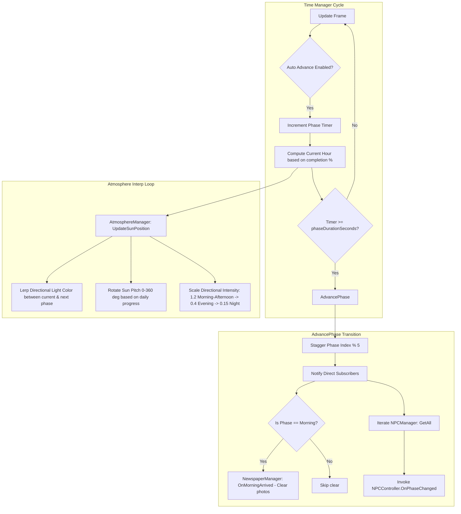
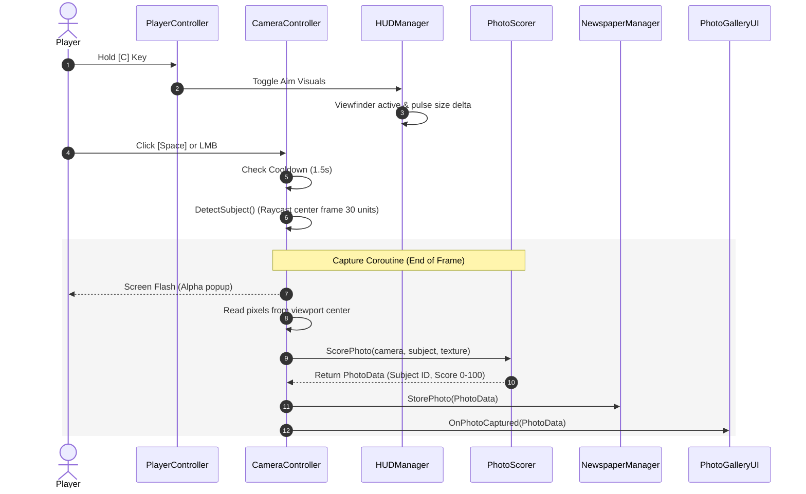
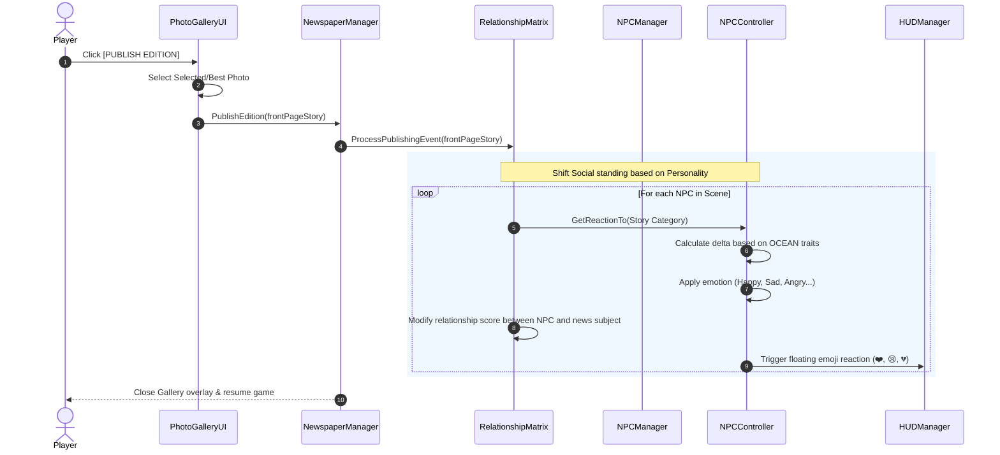

# SNAP: Gameplay Architecture & System Mirror Document

This document provides a comprehensive, high-fidelity technical and architectural mirror of the **SNAP** codebase located under `Assets/_Game/Scripts/`. It maps out the exact system components, their execution lifecycles, class relationships, autonomous emotional state loops, use cases, activity diagrams, and the core Mediterranean Minimalist Game Design Document (GDD) rules.

---

## 1. Core Architecture Overview & Class Relations

The game follows a **Manager-driven Singleton Architecture** initialized via a centralized bootstrapping phase. Communication between core modules is synchronous and leverages direct method invocations rather than decoupled event buses to ensure absolute deterministic execution and easily traceable debug pipelines.

### Class Diagram & Connections

```mermaid
classDiagram
    class GPOyunBootstrap {
        +NuclearColdStart() void
        -SetupEditorialUI(EditorialUI) void
        -EnsureUIStackExists() void
    }

    class GameManager {
        <<Singleton>>
        +GameState CurrentState
        +UnityEvent~GameState~ OnGameStateChanged
        +Initialize(NPCManager, NewspaperManager) void
        +ChangeState(GameState) void
        +PauseGame() void
        +ResumeGame() void
    }

    class TimeManager {
        <<Singleton>>
        +DayPhase CurrentPhase
        +float phaseDurationSeconds
        +float GetCurrentHour() float
        +float GetPhaseProgress() float
        +AdvancePhase() void
        -NotifySystemsOfPhaseChange() void
    }

    class AtmosphereManager {
        -Light mainDirectionalLight
        +Initialize(Light) void
        -UpdateSunPosition() void
    }

    class TownSquareBuilder {
        +float scaleFactor
        +Build() void
        -CreateHouse() void
        -CreateBench() void
        -SpawnNPC() void
    }

    class PlayerController {
        +float moveSpeed
        +float rotationSpeed
        -CharacterController _cc
        -Update() void
    }

    class CameraController {
        +float captureCooldown
        -bool _isViewfinderActive
        -TryCapture() void
        -CaptureFrameCoroutine(PhotoSubject) IEnumerator
        -DetectSubject() PhotoSubject
    }

    class CameraFollow {
        -Transform target
        -Vector3 offset
        +SetTarget(Transform) void
    }

    class NPCManager {
        <<Singleton>>
        -List~NPCController~ _npcs
        +Register(NPCController) void
        +Unregister(NPCController) void
        +GetAll() IReadOnlyList~NPCController~
    }

    class NPCController {
        +int NpcId
        +NPCPersonalityData personality
        +NPCState currentState
        +EmotionType currentEmotion
        +OnPhaseChanged(DayPhase) void
        +ReceiveNews(NewsPublishedData) void
        -WanderRoutine() IEnumerator
        -ReactRoutine() IEnumerator
        -ProcessReadNews() void
    }

    class NPCVisualHelper {
        -NPCController controller
        -Renderer capsuleRenderer
        -Color _baseColor
    }

    class ObstacleAvoidance {
        +float DetectionRange
        +float AvoidanceStrength
        +GetAvoidanceVector(Vector3) Vector3
    }

    class BenchObject {
        -NPCController _occupant
        +IsOccupied bool
        +TryOccupy(NPCController) bool
        +Vacate() void
        +GetSitPosition() Vector3
    }

    class NewspaperManager {
        <<Singleton>>
        -List~PhotoData~ _capturedPhotos
        -List~NewsPublishedData~ _history
        +StorePhoto(PhotoData) void
        +OnMorningArrived() void
        +PublishEdition(NewsStory, NewsStory, NewsStory) void
    }

    class PhotoGalleryUI {
        +CanvasGroup galleryGroup
        +RawImage zoomImage
        +Text scoreLabel
        +Toggle() void
        +OnPhotoCaptured(PhotoData) void
        +OnPublishClicked() void
    }

    class EditorialUI {
        +CanvasGroup editorialCanvasGroup
        +Text statusText
        +Show() void
        +Hide() void
        +OnPublishClicked() void
    }

    class SettingsController {
        -CanvasGroup settingsCanvasGroup
        +ToggleSettings() void
    }

    class GlobalInputListener {
        <<Singleton>>
        +static GlobalInputListener Instance
        -Update() void
    }

    class JournalUI {
        <<Singleton>>
        +CanvasGroup journalCanvasGroup
        +Toggle() void
        +RefreshData() void
    }

    class NewspaperBoardUI {
        <<Singleton>>
        +CanvasGroup boardCanvasGroup
        +Toggle() void
        +RefreshDisplay() void
    }

    %% Relationships
    GPOyunBootstrap ..> TownSquareBuilder : triggers build
    GPOyunBootstrap ..> TimeManager : creates
    GPOyunBootstrap ..> NPCManager : creates
    GPOyunBootstrap ..> NewspaperManager : creates
    GPOyunBootstrap ..> GameManager : creates
    
    TownSquareBuilder ..> NPCController : spawns
    TownSquareBuilder ..> BenchObject : creates

    TimeManager --> NewspaperManager : Direct call on Morning (Reset Photos)
    TimeManager --> NPCManager : Scans active NPCs
    TimeManager ..> NPCController : Direct call on Phase Change

    AtmosphereManager ..> TimeManager : Reads phase progress to drive sun

    NPCController --> NPCManager : Registers self on Start
    NPCController *-- NPCPersonalityData : Configuration
    NPCController *-- ObstacleAvoidance : Collision prevention
    NPCVisualHelper --> NPCController : Reads emotion to tint capsule

    CameraController ..> PhotoSubject : Raycasts center screen
    CameraController ..> NewspaperManager : Stores captured PhotoData
    CameraController ..> PhotoGalleryUI : Notifies on capture

    NewspaperManager --> NPCManager : Delivers published NewsStory to active NPCs
    
    PhotoGalleryUI ..> NewspaperManager : Pulls daily photos & publishes best
    EditorialUI ..> NewspaperManager : Publishes selected category story
    
    SettingsController ..> PlayerController : Adjusts sensitivity variables
    GlobalInputListener ..> SettingsController : Toggles panel (ESC)
    GlobalInputListener ..> PhotoGalleryUI : Toggles gallery (G)
    GlobalInputListener ..> JournalUI : Toggles journal (J)
    GlobalInputListener ..> NewspaperBoardUI : Toggles bulletin board (B)
```



---

## 2. Core Game Loop & Phase Timing Mechanics

The overall flow of the game runs continuously through five distinct `DayPhase` states, driving both the procedural lighting (sun position/color) and NPC behaviors:



### Day Phase Schedules & Schedule Actions

1. **Morning (06:00 - 10:00)**:
   - **Environment**: High-intensity, warm sunrise light (Sun pitch $10^\circ \to 45^\circ$).
   - **Newspaper Reset**: `NewspaperManager.OnMorningArrived()` clears yesterday's temp photos.
   - **NPC Routine**: NPCs check if a new paper edition is available. If yes, they pathfind to the **Newspaper Board** to read and react.
2. **Midday (10:00 - 14:00)**:
   - **Environment**: Clean bright sun (Sun pitch $45^\circ \to 90^\circ$).
   - **NPC Routine**: NPCs congregate around the central square/fountain. Wander radius is constricted to $5\text{m}$.
   - **Social Dynamics**: Friend/Rival checks occur. Best friends trigger affection gestures (hugs), while rivals flee/shiver in fear.
3. **Afternoon (14:00 - 18:00)**:
   - **Environment**: Overhead direct light (Sun pitch $90^\circ \to 145^\circ$).
   - **NPC Routine**: NPCs search for empty benches to sit and relax, or wander with an expanded radius ($10\text{m}$).
4. **Evening (18:00 - 22:00)**:
   - **Environment**: Golden-hour sunset, soft shadows, warm stucco colors (Sun pitch $145^\circ \to 180^\circ$).
   - **NPC Routine**: Cozy chilling/wandering.
5. **Night (22:00 - 06:00)**:
   - **Environment**: Deep cobalt moonlight, low light intensity ($0.15$), cold ambient terms (Sun pitch $180^\circ \to 360^\circ$).
   - **Editorial Desk**: Auto-opens the Editorial Desk UI to force the player to select and compile tomorrow's front-page edition.
   - **NPC Routine**: NPCs abort current routines, vacate benches, and walk home to their spawners.

---

## 3. System Use Cases

Below are the core use cases detailing how the Player and NPCs interact with the game systems:

```mermaid
leftToRightDirection
actor Player
actor NPC

rectangle "SNAP Simulation Engine" {
    Player --> (UC1: Move & Look Around)
    Player --> (UC2: Raise Viewfinder Camera)
    Player --> (UC3: Capture Photo of Subject)
    Player --> (UC4: Open Photo Gallery Overlay)
    Player --> (UC5: Compile & Publish Newspaper)
    Player --> (UC6: Open Observational Journal)
    Player --> (UC7: View Bulletin Board Newspaper)
    Player --> (UC8: Adjust Settings Sensitivity)
    
    NPC --> (UC9: Wander Autonomously)
    NPC --> (UC10: Read Board Newspaper)
    NPC --> (UC11: React to Published Story)
    NPC --> (UC12: Form Social Relationships)
}
```

### Use Case Descriptions

* **UC1: Move & Look Around**: Player navigates the physical 2.5D space using WASD/Arrow keys, looking horizontally/vertically via mouse movements.
* **UC2: Raise Viewfinder Camera**: Holding the `C` key draws the viewfinder frame overlay on screen, zooming slightly and focusing the lens camera.
* **UC3: Capture Photo of Subject**: Pressing `Space`/`LMB` while aiming casts a ray to detect physical subjects, scores the shot based on subject interest, and writes pixels into a local `Texture2D`.
* **UC4: Open Photo Gallery Overlay**: Tapping `G` toggles the high-density light-box gallery, showing today's pictures, composition scores, and publishing trigger.
* **UC5: Compile & Publish Newspaper**: Pressing "Publish Edition" packages the best shot, creates a custom category headline, and pushes it to the public board.
* **UC6: Open Observational Journal**: Tapping `J` opens the social network log, displaying all NPC-to-NPC relationship standings and recent physical observation narratives.
* **UC7: View Bulletin Board Newspaper**: Tapping `B` brings up a close-up visual display of the active published newspaper page currently pinned to the board in the square.
* **UC8: Adjust Settings Sensitivity**: Pressing `ESC` pauses the simulation and opens slider controls for mouse look-speed and master audio volume.
* **UC9: Wander Autonomously**: NPCs idle, pick random coordinate positions, and walk towards them using obstacle avoidance logic.
* **UC10: Read Board Newspaper**: On morning transitions, NPCs pathfind directly to the board's collider coordinates.
* **UC11: React to Published Story**: NPCs parse published categories, filtering them through their custom OCEAN personalities to determine their emotional response.
* **UC12: Form Social Relationships**: NPCs dynamically modify relationship values with peers based on shared news reactions, triggering physical gestures (hugs or fleeing).

---

## 4. Key Subsystem Activity Diagrams

### 1. Photo Capture and Scoring Sequence

This sequence describes how the camera catches a scene, processes URP frame pixels, and rates the composition:



### 2. Publishing and NPC Social Shift Loop

This flow demonstrates the publication of the daily paper, followed by its social impact on the NPC network:



---

## 5. Mediterranean Minimalist GDD Specifications

SNAP uses a strict **Mediterranean Minimalist** aesthetic concept. The environment represents a stylized town square inspired by Santorini, composed entirely out of Unity compound primitives (Zero-Asset Architecture) with clean geometry, flat shading, and no textures.

### 1. Curated Palette (Color Tokens)

The following precise palette tokens must be adhered to for all UI and visual models to achieve a beautiful, professional, Jobs-inspired high-density look:

* **Stucco White** `RGB(250, 242, 235)` / `#FAF2EB`: Primary building walls, UI backdrop accents, clean font labels.
* **Terracotta** `RGB(217, 89, 51)` / `#D95933`: Rounded dome roofs, highlight buttons, slider backdrops, rivalry tags.
* **Cobalt Blue** `RGB(13, 76, 178)` / `#0D4CB2`: Building doors, Clock Tower top-cap, primary slider fills, friendship status markers.
* **Crimson Red** `RGB(204, 25, 25)` / `#CC1919`: Reserved strictly for the **Player** mesh and eye elements to create an immediately recognizable point of focus in the 2.5D space.
* **Slate Grey** `RGB(89, 89, 102)` / `#595966`: Stone ground tiles, main fountain foundation, panel outlines.
* **Fountain Blue** `RGB(102, 178, 242)` / `#66B2F2`: Procedural glass windows, translucent running water.
* **Wood Brown** `RGB(102, 64, 38)` / `#664026`: Announcements bulletin board, rustic benches, tree trunks.
* **Pine Green** `RGB(25, 89, 51)` / `#195933`: Columns of Cypress foliage.

### 2. Autonomous Emotional Loop (OCEAN Reaction Logic)

When an NPC reads a story on the board, their emotional change is computed by mapping the story category against their unique personality coefficients:

$$\Delta \text{Relationship} = f(\text{Category}, \text{OCEAN Traits})$$

* **Agreeableness**: Boosts positive adjustments ($\text{Happy}$) and dampens hostile responses.
* **Neuroticism**: Strongly intensifies negative reactions ($\text{Fearful}$, $\text{Angry}$, or $\text{Sad}$), producing dramatic gesture squashes.
* **Conscientiousness**: Heightens structured responses to $\text{Disaster}$ or $\text{Scandal}$ categories.
* **Extraversion**: Multiplies the scale and float speed of generated screen emojis.

**Capsule Tinting**: The `NPCVisualHelper` automatically detects the NPC's active emotion, using a `Color.Lerp` to smoothly blend the capsule mesh color at a rate of `5f * Time.deltaTime` towards the representative state color (e.g., bright yellow for Happy, deep cobalt for Sad, fiery orange-red for Angry).

### 3. Obstacle Avoidance Mechanics

NPCs walk without clipping or getting stuck against physical environment objects (houses, trees) by utilizing a three-axis raycast probe scanning Layer 7 (Obstacles):
* **Center probe**: Scans forward along current direction up to 3 units.
* **Left probe**: Scans at a -30° angle up to 2.1 units.
* **Right probe**: Scans at a +30° angle up to 2.1 units.

If an obstacle is detected on any ray, an avoidance vector is generated pointing away from the hit surface normal:
$$\vec{V}_{\text{avoidance}} = \sum \vec{N}_{\text{hit}} \times \text{AvoidanceStrength}$$
This avoidance vector is normalized and added directly to the NPC's flat movement vector, preventing character clipping or getting stuck against house boundaries.

---

## 6. Input System Settings (Central Source of Truth)

All gameplay actions and menus map strictly to the New Input System package. To bypass focused component issues, the input loop utilizes a centralized **GlobalInputListener** that polls keyboard states directly.

* **WASD / Arrow Keys**: Character movement (forward/backward) and rotation (turning left/right).
* **Mouse Delta X/Y**: Smooth camera pitch (vertical viewfinder look) and rotation (enabled only when cursor is locked).
* **C Key (Hold)**: Raises viewfinder camera overlay (UI screen zoom).
* **Space / Mouse Left Click**: Snaps photo (only when viewfinder is active).
* **G Key (Tap)**: Opens/Closes the full-screen Lightbox Gallery interface.
* **J Key (Tap)**: Opens/Closes the cozy Observational Journal panel.
* **B Key (Tap)**: Opens/Closes the close-up Newspaper Bulletin Board viewer.
* **Escape Key (Tap)**: Opens/Closes the Settings panel (releases cursor lock).
* **N Key (Tap)**: Opens/Closes the News Desk / Editorial UI panel manually.
