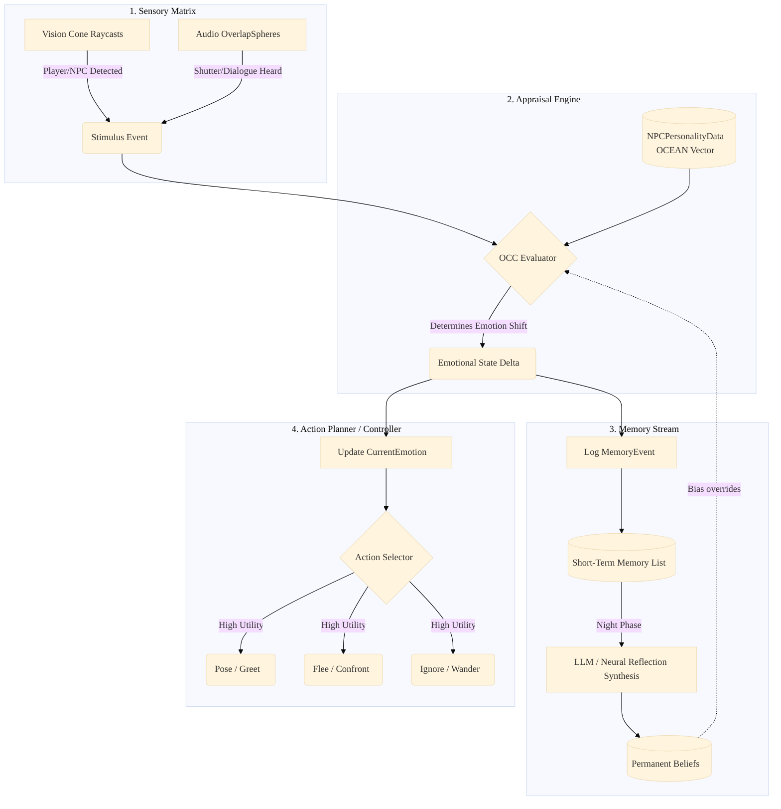
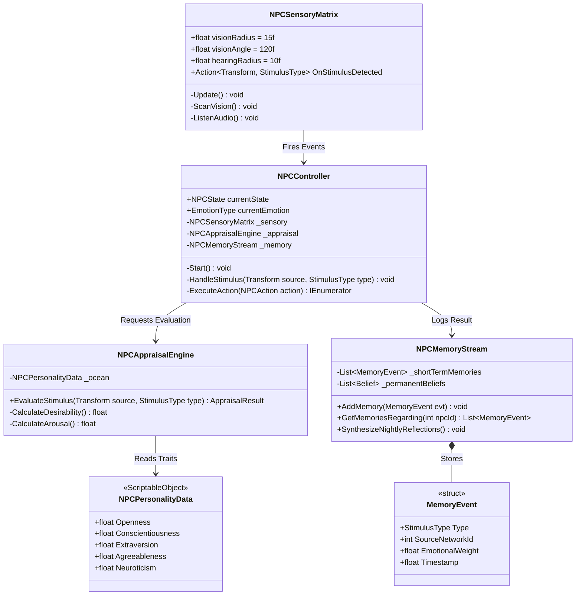
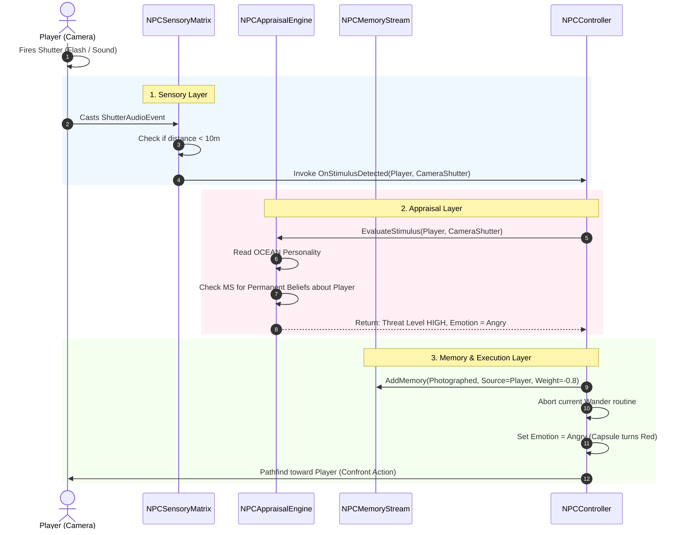

# SNAP: Neural NPC System Diagrams

This document visualizes the exact technical architecture, classes, and activity flows for the decoupled Neural NPC System described in the 100+ Use Case design.

---

## 1. System Architecture Diagram

This diagram shows how the newly decoupled layers connect to process the world and drive the Execution Layer (`NPCController`).

---

## 2. Class & Object Diagram

This diagram details the C# scripts, their properties, methods, and exact relationships in the Unity `Assets/_Game/Scripts/NPC/` folder.

---

## 3. Activity Diagram: "The Player takes a photo"

This traces the exact execution path across the new decoupled components when the player takes a picture.

