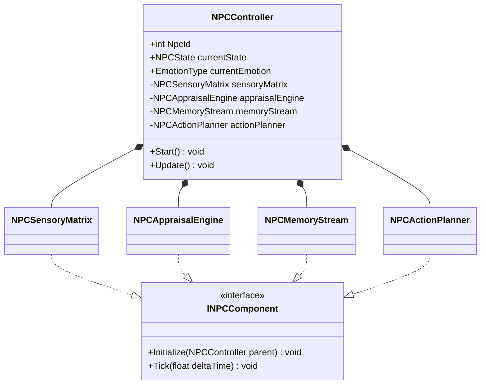
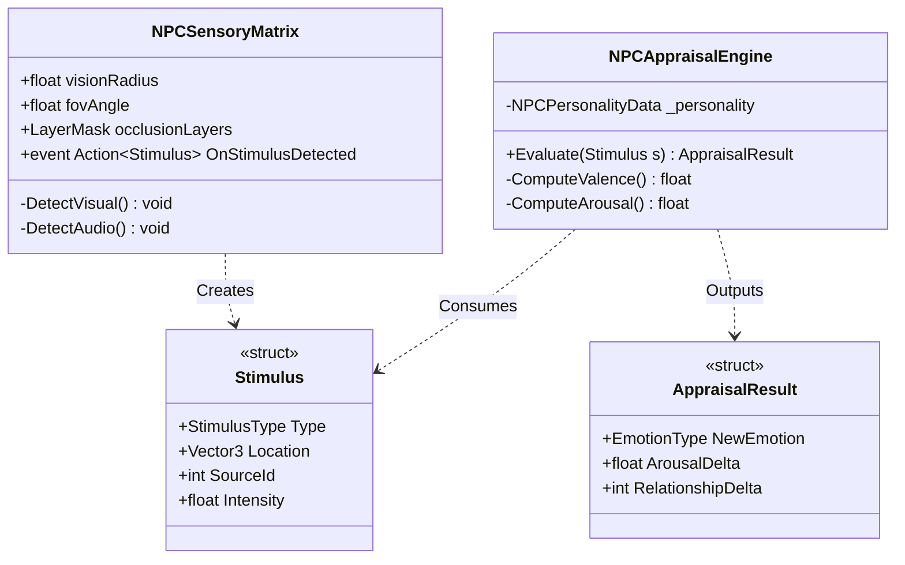
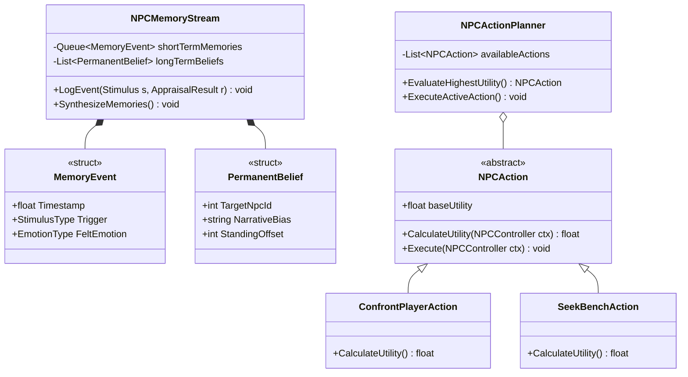
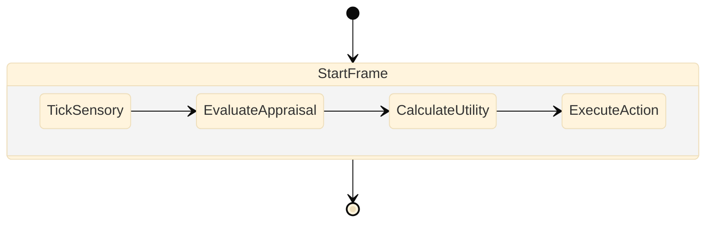

# SNAP: Recursive Neural NPC Architecture & Diagrams

This document contains deep, recursive architectural diagrams mapping out the new Neural NPC System. It breaks the architecture down into Master and Sub-levels for Activities, Classes, and Objects.

---

## 1. RECURSIVE CLASS DIAGRAMS

### 1.1 Master Class Diagram (High-Level Composition)
This diagram shows the primary structural composition of the decoupled `NPCController`.



### 1.2 Sub-Class Diagram: Sensory & Appraisal Nodes
This zooms into the data structures passed between the Sensory and Appraisal layers.



### 1.3 Sub-Class Diagram: Memory & Action Execution
This zooms into the memory structs and the polymorphic Action Planner.



---

## 2. OBJECT DIAGRAMS (INSTANCE SNAPSHOTS)

This diagram shows a physical snapshot of memory at runtime for a specific NPC instance ("Agop") who just got angry at the player.

```mermaid
objectDiagram
    object Agop_Controller {
        NpcId = 42
        NpcName = "Agop"
        currentEmotion = EmotionType.Angry
        currentState = NPCState.Reacting
    }

    object Agop_Personality {
        Openness = 0.8
        Conscientiousness = 0.5
        Extraversion = 0.9
        Agreeableness = 0.2
        Neuroticism = 0.85
    }

    object Agop_MemoryStream {
        MemoryCapacity = 50
    }

    object Memory_01 {
        Timestamp = 14:32:05
        Trigger = StimulusType.CameraFlash
        SourceId = 0 (Player)
        FeltEmotion = EmotionType.Angry
    }

    object Belief_01 {
        TargetNpcId = 0 (Player)
        NarrativeBias = "The photographer violated my privacy."
        StandingOffset = -45
    }

    object Agop_Appraisal {
        CurrentArousal = 0.92
        CurrentValence = -0.75
    }

    Agop_Controller *-- Agop_Personality
    Agop_Controller *-- Agop_MemoryStream
    Agop_Controller *-- Agop_Appraisal
    Agop_MemoryStream *-- Memory_01
    Agop_MemoryStream *-- Belief_01
```

---

## 3. RECURSIVE ACTIVITY DIAGRAMS

### 3.1 Master Activity Diagram: NPC Lifecycle Tick
The core `Update()` loop executed every frame.



### 3.2 Sub-Activity: Sensory Processing (TickSensory)
Details the exact physics logic happening inside `NPCSensoryMatrix.Update()`.

```mermaid
activityDiagram
    start
    :Clear temporary Stimulus Queue;
    
    fork
        :Cast OverlapSphere (Audio, 10m);
        if (Heard Camera Shutter?) then (yes)
            :Calculate Distance to Audio Source;
            :Create Stimulus(Type:Audio, Source:Player);
            :Push to Queue;
        else (no)
        endif
    fork again
        :Cast Raycasts in Vision Cone (120 deg, 15m);
        if (Player in Cone?) then (yes)
            :Raycast to Player Center;
            if (Hit Object == Player?) then (yes - No Occlusion)
                if (Player is Aiming Viewfinder?) then (yes)
                    :Create Stimulus(Type:CameraAimed);
                    :Push to Queue;
                else (no)
                endif
            else (no - Occluded by Wall)
            endif
        else (no)
        endif
    end fork
    
    :Return Stimulus Queue to Controller;
    stop
```

### 3.3 Sub-Activity: Emotion Appraisal (EvaluateAppraisal)
Details the OCC Model calculation inside `NPCAppraisalEngine`.

```mermaid
activityDiagram
    start
    :Pop Stimulus from Queue;
    :Fetch NPC OCEAN Personality;
    :Fetch Permanent Beliefs about Stimulus Source;
    
    if (Stimulus == CameraAimed) then (yes)
        if (Neuroticism > 0.7 AND Agreeableness < 0.4) then (yes)
            :Desirability = Negative;
            :Arousal Delta = +0.5;
            :NewEmotion = Angry;
        else if (Extraversion > 0.8) then (yes)
            :Desirability = Positive;
            :Arousal Delta = +0.2;
            :NewEmotion = Happy (Wants to pose);
        else (Neutral)
            :Desirability = Neutral;
            :NewEmotion = Neutral;
        endif
    else (no)
        :Process other Stimulus types...;
    endif
    
    :Update NPCController.currentEmotion;
    :Send to Memory Stream;
    stop
```

### 3.4 Sub-Activity: Action Selection (CalculateUtility)
Details the GOAP / Utility AI decision making inside `NPCActionPlanner`.

```mermaid
activityDiagram
    start
    :Iterate over all available NPCActions;
    
    while (More Actions?) is (yes)
        :Fetch Action;
        :Calculate Base Utility;
        
        if (Action == ConfrontPlayerAction) then (evaluate)
            if (CurrentEmotion == Angry AND Stimulus == Camera) then (yes)
                :Add +50 to Utility;
            else
                :Utility = 0;
            endif
        endif
        
        if (Action == FleeAction) then (evaluate)
            if (CurrentEmotion == Fearful) then (yes)
                :Add +60 to Utility;
            else
                :Utility = 0;
            endif
        endif
        
        :Store calculated Utility Score;
    endwhile (no)
    
    :Sort Actions by Utility Score descending;
    :Select Action with highest score;
    if (Selected Action != Active Action) then (yes)
        :Abort Active Action;
        :Initialize Selected Action;
    else (no)
    endif
    stop
```

### 3.5 Sub-Activity: Nightly Reflection (Memory Synthesis)
Details what happens when the `TimeManager` shifts to the `Night` phase.

```mermaid
activityDiagram
    start
    :TimeManager triggers OnPhaseChanged(Night);
    :NPC Stops Wandering and returns home;
    
    :NPCMemoryStream extracts all Short-Term Memories;
    if (Count > 0) then (yes)
        :Format Memories into text payload;
        :Send Payload to AI Synthesis Engine (Local Logic or LLM);
        :Generate Permanent Narrative Belief;
        :Calculate Long-Term Standing Offset;
        :Store in LongTermBeliefs array;
        :Clear Short-Term Memories;
    else (no)
        :Sleep peacefully;
    endif
    stop
```
