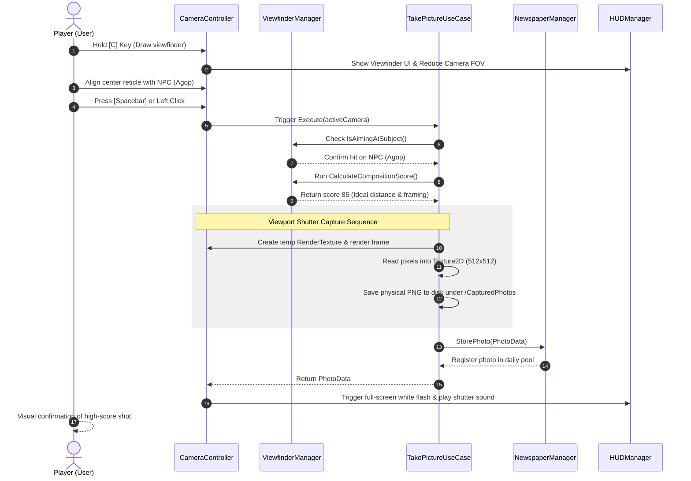
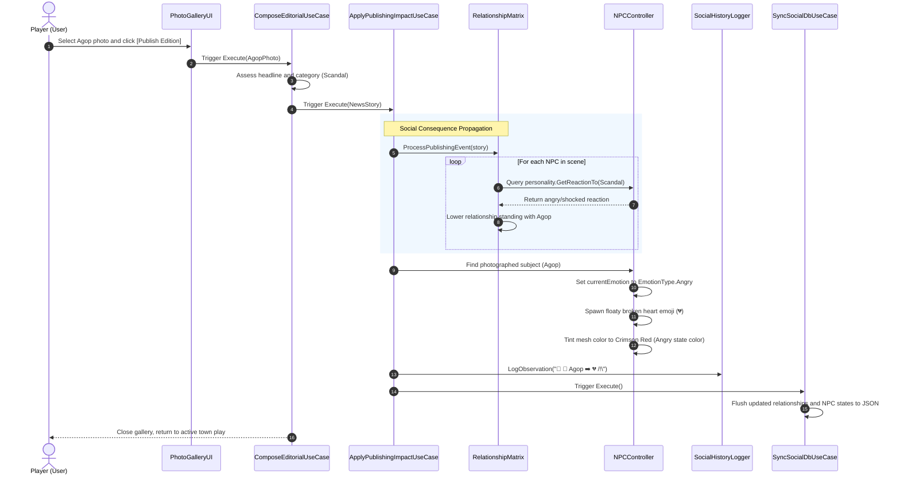
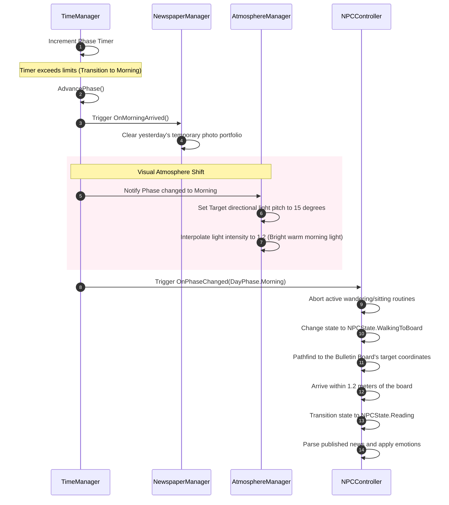
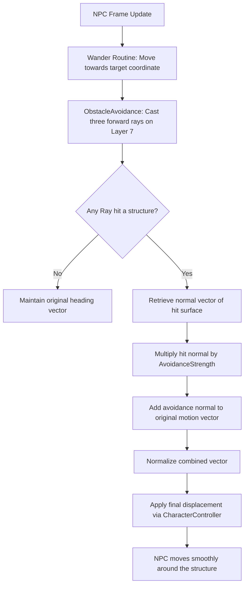
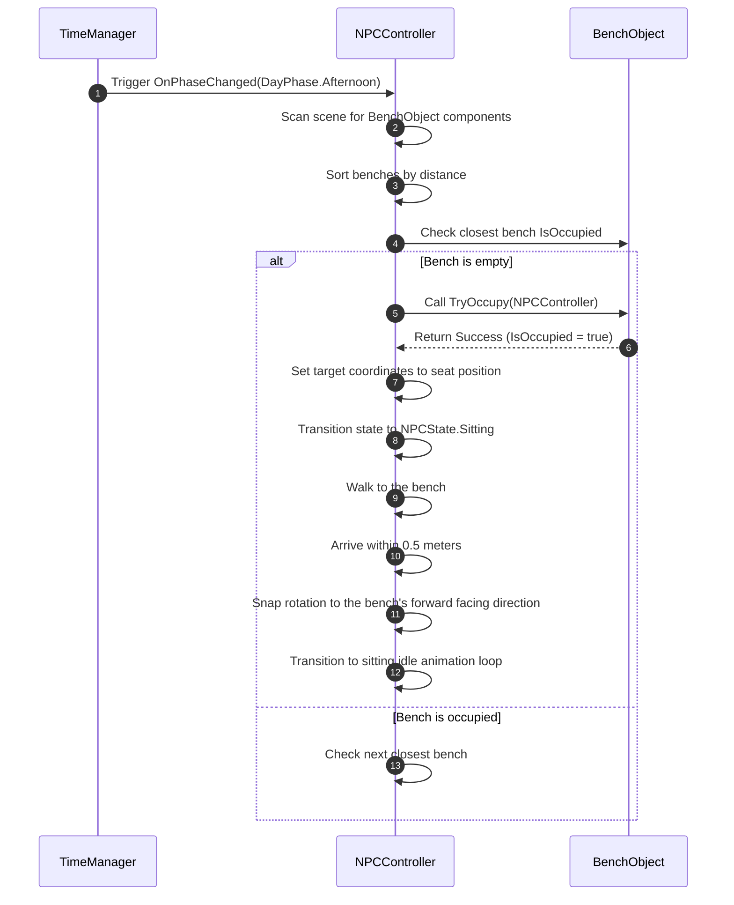

# SNAP: System Use Cases & Core Scenarios Document

This document provides a highly structured, comprehensive breakdown of all **System Use Cases** and **Simulation Scenarios** implemented across the **SNAP** codebase (located under `Assets/_Game/Scripts/`). It acts as the definitive behavioral and technical guide for developers, QA testers, and designers to understand how individual classes interact to drive our 2.5D Mediterranean Pantomime.

---

## 1. Actors in the SNAP Simulation Engine

The simulation is driven by three primary categories of actors, each triggering specific logic blocks:

| Actor | Type | Description | Primary Systems Involved |
| :--- | :--- | :--- | :--- |
| **Player** | User-Controlled | Navigates the physical square, aims the viewfinder camera, captures compositions, reviews photos in the lightbox gallery, and publishes daily front-page stories. | `PlayerController`, `CameraController`, `GlobalInputListener`, `GalleryController` |
| **NPC (Citizen)** | Autonomous Agent | Wanders the square, avoids structures, seeks out empty benches, reads the bulletin board, reacts to daily headlines, and modifies their emotional states and relationships. | `NPCController`, `NPCManager`, `NPCVisualHelper`, `RelationshipMatrix` |
| **Simulation Director** | Environmental System | Orchestrates bootstrapping, phase advancement, time tracking, solar progression, and persistence loops. | `GPOyunBootstrap`, `GameManager`, `TimeManager`, `AtmosphereManager`, `SocialDatabase` |

---

## 2. Comprehensive System Use Cases

Below is the structured registry of use cases mapping actor interactions to the underlying C# scripts, pre-conditions, and post-conditions.

```mermaid
leftToRightDirection
actor Player as "Player (User)"
actor NPC as "NPC (Citizen)"
actor Director as "Simulation Director"

rectangle "SNAP Simulation Core" {
    %% Player Actions
    Player --> (UC-P01: Move & Navigate)
    Player --> (UC-P02: Viewfinder Aim & Target)
    Player --> (UC-P03: Viewport Shutter Capture)
    Player --> (UC-P04: Portfolio Lightbox Review)
    Player --> (UC-P05: Front-Page Editorial Publish)
    Player --> (UC-P06: Newspaper Board Audit)
    Player --> (UC-P07: Observational Journal Review)
    Player --> (UC-P08: System Pause & Settings Adjust)

    %% NPC Actions
    NPC --> (UC-N01: Autonomous Phase Wandering)
    NPC --> (UC-N02: Newspaper Board Inspection)
    NPC --> (UC-N03: Story Parsing & Emotion Shift)
    NPC --> (UC-N04: Relationship Standing Adjust)
    NPC --> (UC-N05: Bench Seek & Relax)
    NPC --> (UC-N06: Day-Phase Event Scheduling)

    %% Director Actions
    Director --> (UC-S01: Bootstrapping & Warm Start)
    Director --> (UC-S02: Phase Shift & Sun Interp)
    Director --> (UC-S03: Simulation State Persistence)
}
```

### 2.1 Player-Driven Use Cases

#### UC-P01: Player Movement & Navigation
*   **Actor**: Player
*   **Description**: The Player moves across the 2.5D space using WASD or arrow keys and turns using mouse movements.
*   **Pre-conditions**: Game state is `Playing`. Settings panel and overlay UIs are closed.
*   **Technical Pipeline**: `PlayerController.cs` processes input from `InputSystem_Actions.inputactions`. Translates keyboard input into character velocity vectors. Applies a gravity constant and uses the Unity `CharacterController` to slide along collision boundaries.
*   **Post-conditions**: Player position is updated in world coordinates without clipping through static structures (Layer 7).

#### UC-P02: Viewfinder Aiming & Subject Targeting
*   **Actor**: Player
*   **Description**: The Player holds a designated key (`C`) to raise the viewfinder overlay, zoom in slightly, and lock the camera on physical entities in the square.
*   **Pre-conditions**: Game state is `Playing`. Shutter cooldown has expired.
*   **Technical Pipeline**: `CameraController.cs` detects the hold event. It toggles the viewfinder canvas group alpha inside `HUDManager.cs` to 1. Toggles an active boolean `_isViewfinderActive` and applies a slight Field of View (FoV) zoom reduction to the camera. It continuously casts a center ray (`30f` distance units) to identify if it is colliding with a `PhotoSubject` component.
*   **Post-conditions**: UI overlays a beautiful crosshair finder. The active target is dynamically updated and cached.

#### UC-P03: Viewport Photo Capture & Composition Scoring
*   **Actor**: Player
*   **Description**: While the viewfinder is active, the Player clicks the Left Mouse Button or Spacebar to capture the viewport, compute a composition score, and write a PNG onto physical disk.
*   **Pre-conditions**: Viewfinder is active (`_isViewfinderActive == true`). Camera cooldown (`captureCooldown = 1.5s`) is inactive.
*   **Technical Pipeline**: Triggers `TakePictureUseCase.cs`. 
    1. Casts a viewport center ray to detect a `PhotoSubject` using `ViewfinderManager.Instance.IsAimingAtSubject`.
    2. Calculates a composition score (0 to 100) using `CalculateCompositionScore`, based on subject distance and framing.
    3. Allocates a temporary `RenderTexture` (512x512, 24-bit depth) to capture the active camera pixels.
    4. Converts the render texture to a `Texture2D` and encodes it as a high-fidelity PNG.
    5. Saves the PNG file to disk under `Assets/_Game/CapturedPhotos/{uuid}_{timestamp}_{subjectName}.png`.
    6. Generates a fresh `PhotoData` object containing the texture, world position, primary subject, composition score, and file path.
    7. Registers `PhotoData` into `NewspaperManager.Instance.StorePhoto(data)` and cleans up the temporary render texture.
*   **Post-conditions**: A physical image is persisted to disk, the photo counts towards today's album, and the viewfinder HUD pulses with a flash screen effect.

#### UC-P04: Portfolio Lightbox Review
*   **Actor**: Player
*   **Description**: The Player presses `G` to open a light-box gallery displaying all photos taken during the current day, along with their composition ratings.
*   **Pre-conditions**: Game state is `Playing`. Overlay UI exclusions are satisfied (no other overlay UI is active).
*   **Technical Pipeline**: `GlobalInputListener.cs` detects the `G` tap. It triggers `PhotoGalleryUI.Instance.Toggle()`. This changes the game state to `Paused`, unlocks the mouse cursor, and loads today's cached photo portfolio from `NewspaperManager.Instance.GetTodaysPhotos()`. The UI instantiates visual elements in the light-box and registers clicking events. Selecting a thumbnail executes `SelectPictureUseCase.cs`, which highlights the texture, zooms, and updates the canvas display.
*   **Post-conditions**: The gallery interface overlays the screen. Character controls are locked.

#### UC-P05: Front-Page Editorial Composition & Distribution
*   **Actor**: Player
*   **Description**: From the gallery or during the Night phase desk transition, the Player selects a captured picture, composes a headline category, and publishes it, dispersing immediate consequences.
*   **Pre-conditions**: Gallery UI is open. At least one valid photo is selected.
*   **Technical Pipeline**: Executed through `ComposeEditorialUseCase.cs` and `ApplyPublishingImpactUseCase.cs`.
    1. The Player clicks the "Publish Edition" button.
    2. `StoryComposer.CreateHeadlineFor(photo)` assesses the main subject to generate a procedural headline.
    3. `StoryComposer.AssessCategory(photo)` classifies the story (e.g., `Scandal`, `Local`, `Disaster`).
    4. Instantiates a new `NewsStory` object and registers it with the public bulletin board using `NewspaperManager.Instance.PublishEdition(story)`.
    5. `ApplyPublishingImpactUseCase.Instance.Execute(story)` is triggered:
        *   Instructs `RelationshipMatrix.Instance.ProcessPublishingEvent(story)` to calculate and adjust social standings.
        *   Appends a pure emoji-string highlight (e.g., `📰 👤 Agop ➡️ 💔 /!\`) to `SocialHistoryLogger.Instance.LogObservation` for the Observational Journal.
        *   Iterates through all active `NPCController`s in the scene to update the emotion value of the photographed subject (e.g., `EmotionType.Angry` if it is a Scandal, or `EmotionType.Happy` otherwise).
        *   Triggers `SyncSocialDbUseCase.Instance.Execute()` to snapshot the entire simulation database onto physical disk as a JSON backup.
    6. Gallery UI closes, cursor locks, and game state reverts to `Playing`.
*   **Post-conditions**: The daily paper is pinned to the board. NPC relationship scores shift. A database snapshot is saved. Today's temp photo cache is cleared for tomorrow.

#### UC-P06: Newspaper Board Audit
*   **Actor**: Player
*   **Description**: The Player presses `B` to view the currently published front-page newspaper page pinned to the town square's physical bulletin board.
*   **Pre-conditions**: Game state is `Playing` or `Paused` (board UI is not yet open).
*   **Technical Pipeline**: `GlobalInputListener.cs` detects the `B` input. It calls `NewspaperBoardUI.Instance.Toggle()`. If shown, the game state changes to `Paused`, character movement is locked, and the mouse cursor is released. The board UI reads the active `NewsStory` from `NewspaperManager.Instance` and draws the custom layout, displaying the photo, headline, and category.
*   **Post-conditions**: The Player can inspect the active front page. Closing the board returns the game to `Playing` and locks the cursor.

#### UC-P07: Observational Social Journal Review
*   **Actor**: Player
*   **Description**: The Player presses `J` to open the Observational Journal to review physical NPC standings, friend/rival counts, and historical emoji observation logs.
*   **Pre-conditions**: Game state is `Playing`. Other UI overlays are closed.
*   **Technical Pipeline**: `GlobalInputListener.cs` detects `J`. It triggers `JournalUI.Instance.Toggle()`. This pauses the game state, activates the cursor, and populates list rows. It queries the `RelationshipMatrix.Instance` to render active citizen cards, showing exact numeric standing levels (ranging from -100 to 100), and loads observation arrays from `SocialHistoryLogger.Instance`.
*   **Post-conditions**: The journal UI overlays the view. Closing it resumes the active town simulation.

#### UC-P08: System Pause & Settings Adjustment
*   **Actor**: Player
*   **Description**: The Player presses `ESC` to pause the simulation and adjust settings like mouse sensitivity and volume.
*   **Pre-conditions**: None (acts as a global escape override).
*   **Technical Pipeline**: `GlobalInputListener.cs` registers `ESC`. It calls `SettingsController.Instance.ToggleSettings()`. This triggers `GameManager.Instance.PauseGame()`, sets the internal `CanvasGroup` alpha to 1, and releases the cursor lock. Sliders for sensitivity update properties on the `PlayerController`.
*   **Post-conditions**: Simulation is frozen (time scale = 0). Closing the panel resumes active physics.

---

### 2.2 NPC-Driven Use Cases

#### UC-N01: Autonomous Day-Phase Wandering
*   **Actor**: NPC
*   **Description**: NPCs move around the square inside a restricted or broad boundary, avoiding static geometry structures.
*   **Pre-conditions**: NPC state is `Idle` or `Wandering`. Day phase is Morning, Midday, Afternoon, or Evening.
*   **Technical Pipeline**: 
    1. The `NPCController.cs` coroutine `WanderRoutine` fires.
    2. Selects a random target coordinate vector within a radius (e.g., $5\text{m}$ during Midday, $10\text{m}$ during Afternoon).
    3. Moves towards the target at a constant speed (`moveSpeed = 1.5f`).
    4. In `Update`, the controller runs `ObstacleAvoidance.cs` to cast three forward probes (Center at 3 units, Left/Right at 2.1 units at 30° angles) on Layer 7 (Obstacles).
    5. If a hit is registered, it computes an avoidance vector based on the surface normal.
    6. Adds the avoidance vector to the movement vector, adjusting the character's heading to smoothly bypass the wall.
*   **Post-conditions**: NPC walks to target position and loops back to `Idle` without clipping.

#### UC-N02: Newspaper Board Inspection
*   **Actor**: NPC
*   **Description**: At the start of the Morning phase, NPCs walk to the physical bulletin board in the square to read the newly published daily paper.
*   **Pre-conditions**: Day phase advances to `Morning`. A newspaper exists on the board.
*   **Technical Pipeline**: 
    1. `NPCController.OnPhaseChanged(DayPhase.Morning)` changes the NPC's state to `WalkingToBoard`.
    2. The target position is set to the bulletin board's interaction coordinate vector.
    3. NPC moves towards the board at `runSpeed` ($3f$).
    4. Once distance to the board is $< 1.2\text{m}$, the NPC transitions to the `Reading` state and starts a reading timer.
*   **Post-conditions**: NPC sits in front of the board, reading the front-page story.

#### UC-N03: Published Editorial Parsing & Emotional Reaction
*   **Actor**: NPC
*   **Description**: While reading the board, the NPC parses the published news story and updates their active emotion based on their OCEAN personality traits.
*   **Pre-conditions**: NPC state is `Reading`. News story is valid.
*   **Technical Pipeline**: 
    1. Inside the `ReactRoutine` in `NPCController.cs`, the NPC queries `personality.GetReactionTo(story.Category)`.
    2. If a rule matches (e.g. `Scandal` yields `EmotionType.Angry`), the NPC shifts their `currentEmotion` to that state.
    3. If personality data is missing, it falls back to a switch-case: `Scandal` or `Disaster` triggers `EmotionType.Angry`, while other categories yield `EmotionType.Happy`.
    4. The NPC triggers floating emotion emojis above their mesh (e.g., ❤️ for positive, 💔 for negative).
    5. `NPCVisualHelper.cs` detects the emotion change and runs a smooth `Color.Lerp` at `5f * Time.deltaTime` to blend the capsule's material color to the emotion color (e.g., Yellow for Happy, Crimson for Angry, Cobalt for Sad).
*   **Post-conditions**: NPC shows visual feedback (tinted mesh, floaty emojis) indicating their reaction.

#### UC-N04: Dynamic Social Standing Shift & Gesturing
*   **Actor**: NPC
*   **Description**: Based on news reactions, NPCs modify relationship standing values with peers and perform gestures like friendly hugs or fleeing.
*   **Pre-conditions**: Relationship matrix and news subject are valid.
*   **Technical Pipeline**: 
    1. Inside `RelationshipMatrix.ProcessPublishingEvent(story)`, the system adjusts the relationship standing between each citizen and the story's main subject.
    2. Standing updates are scaled by the NPC's personality:
        *   `Happy` reactions increase standing: $\Delta \text{Standing} = +[25 \times \text{Intensity} \times (1 + \text{Agreeableness})]$.
        *   `Angry`/`Sad` reactions decrease standing: $\Delta \text{Standing} = -[30 \times \text{Intensity} \times (2 - \text{Agreeableness})]$.
    3. When NPCs get close to high-standing friends ($> 60$), `NPCController.cs` triggers a friendly hug state (`NPCState.Hugging`), executing a squash/stretch scale bob in `PantomimeGestures.cs`.
    4. When NPCs approach rivals ($< -50$), `NPCController.cs` triggers a fleeing state (`NPCState.Fleeing`), pushing the NPC to run away at high speed.
*   **Post-conditions**: Citizens dynamically update their physical spacing and social circles.

#### UC-N05: Bench Seeking & Dwell Relaxation
*   **Actor**: NPC
*   **Description**: During the Afternoon, NPCs look for empty benches in the town square to sit and relax.
*   **Pre-conditions**: Day phase is `Afternoon`. NPC state is `Idle` or `Wandering`.
*   **Technical Pipeline**: 
    1. `NPCController.OnPhaseChanged(DayPhase.Afternoon)` initiates the seat-seeking routine.
    2. Searches the scene for `BenchObject` components.
    3. Finds the closest bench where `IsOccupied == false`.
    4. Calls `BenchObject.TryOccupy(this)`. If successful, sets the target position to the bench's seat coordinate and transitions state to `Sitting`.
    5. Once the NPC arrives within $0.5\text{m}$ of the seat, they snap to the bench's rotation and play sitting animations.
*   **Post-conditions**: The NPC sits on the bench. The bench remains locked (`IsOccupied = true`) until vacated.

#### UC-N06: Day-Phase Event Scheduling & Traveling
*   **Actor**: NPC
*   **Description**: NPCs coordinate their daily schedules, moving between their homes and the town square as the phases of the day progress.
*   **Pre-conditions**: `TimeManager` issues a phase-advance notification.
*   **Technical Pipeline**: `NPCController.cs` implements `OnPhaseChanged(DayPhase phase)` to handle phase schedules:
    *   `Morning`: Walk to board, read news.
    *   `Midday`: Congregate around the fountain, perform friend/rival proximity checks.
    *   `Afternoon`: Search for empty benches to relax.
    *   `Evening`: Wander and relax in small groups.
    *   `Night`: Vacate benches, abort active routines, and pathfind to home spawners. Once home, they enter `Idle` and turn off visual indicators.
*   **Post-conditions**: NPC positions align with the current time of day.

---

### 2.3 System-Driven Use Cases

#### UC-S01: System Initialization & Bootstrapping
*   **Actor**: Simulation Director
*   **Description**: On scene load, the system runs initialization checks, creating missing managers, bootstrapping the UI stack, and building the town square.
*   **Pre-conditions**: Scene loads. `GPOyunBootstrap` script is present.
*   **Technical Pipeline**: 
    1. `GPOyunBootstrap.cs` executes `Awake` (or `NuclearColdStart`).
    2. Checks for existing manager singletons (`GameManager`, `TimeManager`, `NewspaperManager`, `NPCManager`). If any are missing, it spawns new instances.
    3. Checks for the `[UI]` root object. Creates Newspaper Board, Gallery, Journal, and Settings canvases if missing.
    4. Spawns `TownSquareBuilder.cs` and calls `Build()`, generating houses, paths, trees, benches, and NPC spawners based on scale variables.
    5. Set game state to `Playing`.
*   **Post-conditions**: A playable town scene is constructed and all systems are ready.

#### UC-S02: Phase Shift & Sun Interp
*   **Actor**: Simulation Director
*   **Description**: The system increments time, shifts day phases, and adjusts the sun's position and lighting colors accordingly.
*   **Pre-conditions**: Game state is `Playing`.
*   **Technical Pipeline**: 
    1. `TimeManager.cs` increments a phase timer in `Update`.
    2. Once `Timer >= phaseDurationSeconds`, it runs `AdvancePhase()`.
    3. Shifts the phase (e.g. `Midday` to `Afternoon`) and notifies registered systems.
    4. `AtmosphereManager.cs` reads the phase progress.
    5. Automatically rotates the directional light's pitch angle ($0^\circ$ to $360^\circ$) to reflect the sun's travel across the sky.
    6. Blends directional light color and intensity (e.g., $1.2$ during Midday, $0.4$ in the Evening, $0.15$ at Night) using a smooth linear interpolation.
*   **Post-conditions**: Lighting transitions match the active day phase.

#### UC-S03: Social Simulation State Persistence & Snapshotting
*   **Actor**: Simulation Director
*   **Description**: Persists simulation checkpoints (such as NPC emotions, positions, and relationship tables) to a local JSON database on disk.
*   **Pre-conditions**: `SyncSocialDbUseCase.cs` is executed (triggered automatically after publishing or manual save).
*   **Technical Pipeline**: 
    1. `SyncSocialDbUseCase.cs` gathers all active NPCs and the `RelationshipMatrix.Instance`.
    2. Calls `SocialDatabase.Instance.SyncFromSimulation(npcs, matrix)`.
    3. Generates a serializable data structure containing NPC names, active emotional states, OCEAN values, and pairwise relationship matrices.
    4. Serializes the structure into a clean JSON string.
    5. Writes the string to disk at `Application.persistentDataPath` or the project data folder.
*   **Post-conditions**: Simulation data is saved to disk, preventing data loss across runs.

---

## 3. High-Fidelity Simulation Scenarios

This section details concrete scenarios illustrating how systems interact under the hood during typical gameplay moments.

### Scenario 1: Capturing a High-Score Photo of a Citizen

This scenario covers a player aiming at a citizen and taking a well-framed photo.



---

### Scenario 2: Publishing a Scandal and Spurring a Town Square Shockwave

This scenario covers the player publishing a Scandal about an NPC, shifting relationships and emotions.



---

### Scenario 3: Morning Routine Transition - NPCs Rushing to the Board

This scenario covers the start of a new day, clearing old photos and driving NPCs to read the paper.



---

### Scenario 4: Obstacle Avoidance Mechanics in Action

This scenario covers an NPC avoiding a collision with a static structure (like a house).



---

### Scenario 5: Afternoon Dwell & Bench Coziness

This scenario covers NPCs seeking out benches to sit and relax in the afternoon.



---

## 4. Architectural Summary

By mapping all game features to **deterministic, decoupled Use Cases** and **Scenarios**, SNAP ensures that gameplay logic remains robust and easy to expand. Directing interactions through structured use-case instances (such as `TakePictureUseCase` and `ApplyPublishingImpactUseCase`) prevents coupling between UI components and gameplay systems, laying a strong foundation for scaling the Mediterranean town square.
