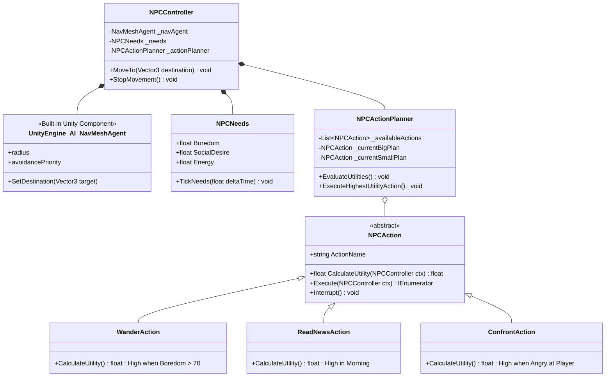
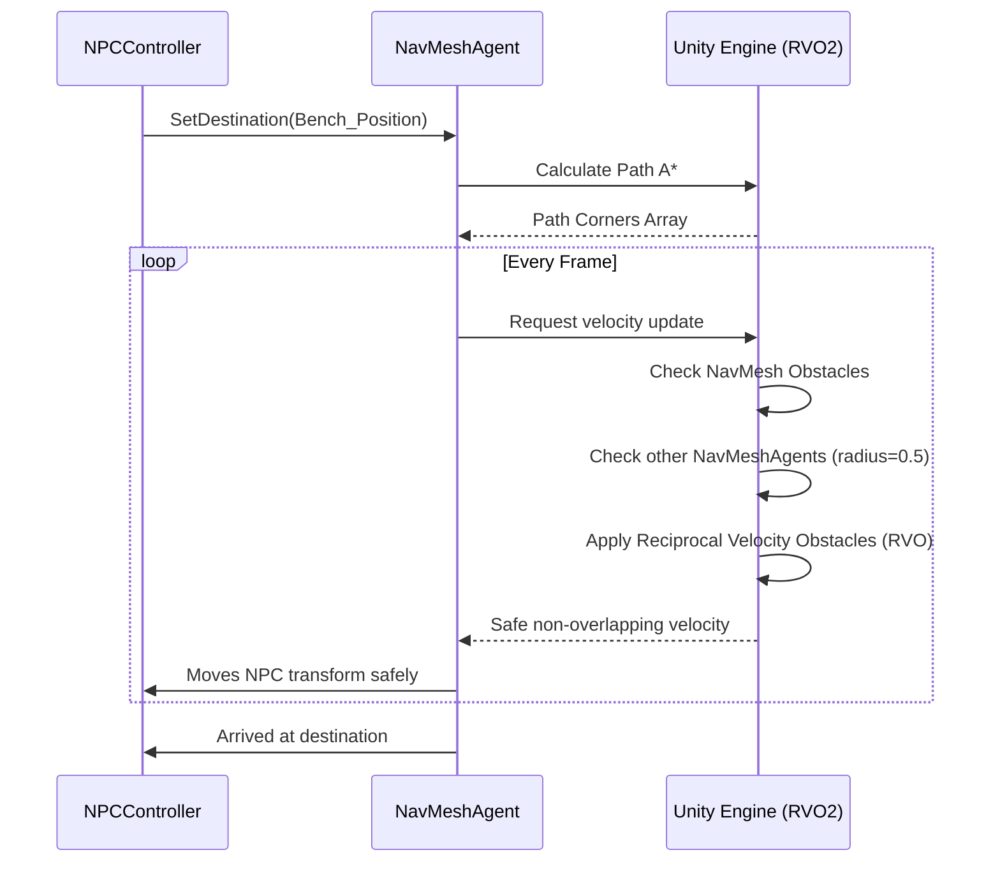

# SNAP: Utility AI & Movement Overhaul Diagrams

These diagrams visualize the architectural changes outlined in the Implementation Plan, focusing on the switch to `NavMeshAgent` for collision avoidance and the introduction of layered goals via `NPCActionPlanner`.

---

## 1. Class Diagram (Utility AI & NavMesh Layer)

This diagram highlights how the new `NavMeshAgent` and the Needs-based `NPCActionPlanner` integrate into the `NPCController`.



---

## 2. Activity Diagram: Layered Goals Evaluation

This traces how an NPC dynamically interrupts a "Big Plan" (Walking to read news) with a "Small Plan" (Getting bored and wandering) or a "Reaction Plan" (Getting angry).

```mermaid
activityDiagram
    start
    :Action Planner Tick (Every 1.0s);
    
    :Fetch Current Needs (Boredom, Energy, Social);
    :Fetch Current Emotion (Appraisal Output);
    
    fork
        :Evaluate ReadNewsAction (Big Plan);
        if (Time == Morning AND HasNotReadNews) then (yes)
            :Utility = 60;
        else
            :Utility = 0;
        endif
    fork again
        :Evaluate WanderAction (Small Plan);
        if (Boredom > 80) then (yes)
            :Utility = 40 + (Boredom * 0.5) -> ~80;
        else
            :Utility = 10;
        endif
    fork again
        :Evaluate ConfrontAction (Reaction Plan);
        if (Emotion == Angry) then (yes)
            :Utility = 100 (Overrides everything);
        else
            :Utility = 0;
        endif
    end fork
    
    :Compare Utilities;
    if (Highest Utility Action != Current Active Action) then (yes)
        :Call ActiveAction.Interrupt();
        :NavMeshAgent.ResetPath() (Stop Movement);
        :Set ActiveAction = Highest Utility Action;
        :Start ActiveAction.Execute();
    else (no)
        :Continue executing Current Action;
    endif
    
    stop
```

---

## 3. Object Diagram (Runtime Snapshot of Layered Goals)

A physical snapshot of an NPC's brain when their small plan (Boredom) interrupts their big plan.

```mermaid
objectDiagram
    object NPC_Zeynep {
        Name = "Zeynep"
        State = "Wandering (Bored)"
    }

    object NavMeshAgent {
        speed = 2.5
        radius = 0.5
        destination = (12.5, 0, -4.2)
        avoidancePriority = 50
    }

    object Needs_Component {
        Boredom = 92.5  << Critical
        SocialDesire = 20.0
        Energy = 85.0
    }

    object ActionPlanner_Component {
        CurrentBigPlan = "ReadNewsAction (Suspended)"
        ActiveSmallPlan = "WanderAction"
    }

    object WanderAction_Instance {
        UtilityScore = 86.25
        TargetRadius = 15f
    }

    object ReadNewsAction_Instance {
        UtilityScore = 60.0
    }

    NPC_Zeynep *-- NavMeshAgent
    NPC_Zeynep *-- Needs_Component
    NPC_Zeynep *-- ActionPlanner_Component
    ActionPlanner_Component *-- WanderAction_Instance
    ActionPlanner_Component *-- ReadNewsAction_Instance
```

---

## 4. Activity Diagram: NavMesh Collision Avoidance

How `NavMeshAgent` implicitly solves the "iç içe geçme" (overlapping) issue without manual transform math.


